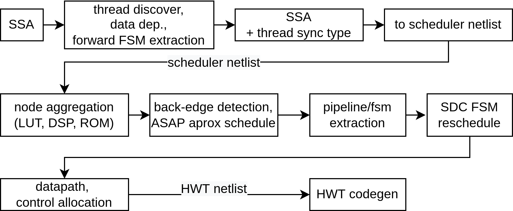
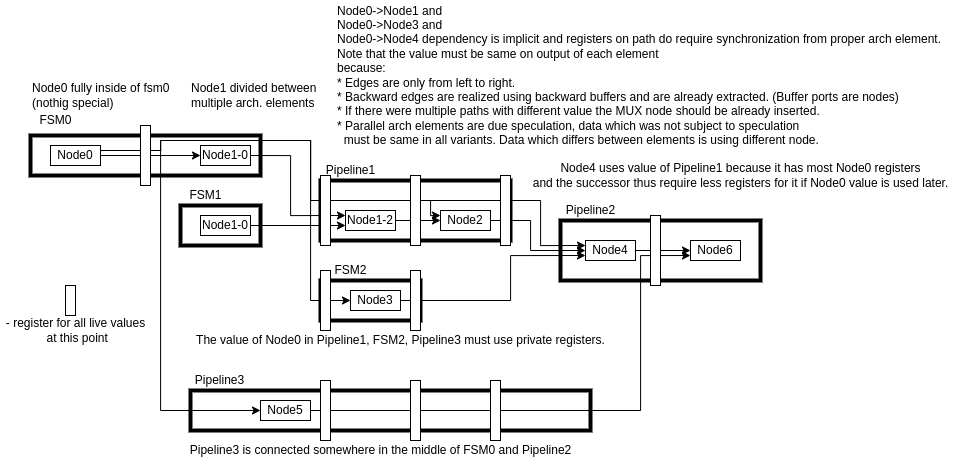

Welcome to hwtHls documentation!
================================

Readme File
-----------

Library for automated translation of an algorithm to a hardware architecture (high-level synthesis, HLS).
Written in C++/Python. 

.. toctree::
   :maxdepth: 3
   :caption: Contents:

   hwtHls

Indices and tables
------------------

* :ref:`genindex`
* :ref:`modindex`
* :ref:`search`

* :ref:`README-dev`
* :ref:`dev-llvm-basics-install-and-use`

How is hardware design described in using this library?
-------------------------------------------------------
Components in this library are described in regular Python. Components are build using Hardware Construction Framework named HWT, which also handles code generator related things.
HWT framework describes hardware using dataflow like description. This framework is generally used to describe all interfaces, hierarchy, and non algorithmic code.
HwtHls provides a specific object (HlsScope) which can translate a Python function or manually crafted AST to a hardware architecture described in HWT. 
The translation is implemented as a set of compiler passes and is build to allow user code to decide how it should be translated and which transformations should be applied.
This efficiently allows to specify a heuristic for every optimization and to selectively exclude/add transformations during the translation.

What this library actually does?
--------------------------------
This library has 2 frontends which are translating AST objects or python bytecode to SSA using algorithm based on [simpleToSSA]_.
After the code is in LLVM SSA form any LLVM analysis/pass can be applied. The next step is usually lowering of frontend related things.
Next the :ref:`hwtHls::SlicesToIndependentVariablesPass` is used to recursively split the variables to a non-overlapping slices with a single driver to increase efficiency of LLVM passes
as LLVM interpretation of bit masking/selections/set is limited and generally insufficient for hardware code generators.
By default we use LLVM O3 like optimization pipeline with additional bit-width reductions.
This pipeline has the target machine configured to FPGA like instruction set and it uses attributes and metadata to perform transformations on demand.
The passes are registered in your HlsPlatform specification and the default config is listed in :ref:`hwtHls.platform.platform` and /hwtHls/llvm/llvmCompilationBundle.cpp .

.. image:: _static/hwtHls_overview.png

Mentioned optimizations are responsible for most common optimizations like Common Sub-expression Elimination (CSE), code hoisting/sinking, CFG simplifications,
Corelated value propagation, Sparse Constant Propagation (SCP), Jump threading, Speculations, Algebraic simplifications, bitwidth reduction, load/store reductions and various loop idiom optimizations.
Each step is optional and can be also disabled with fine level granularity.

The next step is conversion of LLVM IR to LLVM MIR which is assembly like format. HwtHls defines a custom llvm TargetMachine in hwtHls/llvm/targets/ and uses llvm GlobalISel
to extract individual instructions.

The next step is to translate LLVM MIR to netlist for scheduling and ultimately the scheduled netlist to HWT (RTL like) netlist for code generator.

This step does not modify input MIR but collects own metadata which are generated from MIR features and could be generated also from user specified attributes.
The goal of this transformation is to translate input MIR to RTL netlist with minimum amount of target resources, minimum control complexity and maximum throughput and minimum latency.
However without additional specification the goal would be infeasible (It is not generally possible to achieve all mentioned at once.)

From this reasons the pipeline of compiler is modifiable and user application can ask for a specific transformations on a specific place and time during the translation.

First back-edges in data and control flow are detected (in SSA). The detection of back-edges corresponds to a minimum feedback arc set problem.
We are using greedy heuristic with a linear run time which is based on search of strongly connected components and then removal of the edge which is
probably closing least of cycles in the graph [feedbackarc]_. We used this heuristic because we find it fast enough and sufficiently performing for network and controller applications.

Once back-edges are detected we can proceed to next phase. We resolve the most likely synchronization relations between threads in the MIR.
The thread could be generated by an user but in most of cases it is automatically discovered by liveness analysis. For this purpose we define a thread
as transitive enclosure of the use and define relation. This means that all instructions in the single thread do not require an additional synchronization
because synchronization is already done by the data.
This is necessary because we do not generate any global state by default and any instruction can happen anytime and we need to synchronize individual threads
to assert correct behavior of the program.
Once we detected threads we use this information to resolve the synchronization type between threads and MIR Basic Blocks.
The block must have synchronization if any threads inside require synchronization and at least one is starting in this block or if the block have multiple predecessors
or if successor requires synchronization. In addition a initial sequence of the block requires synchronization because the execution count must be limited to 1.
Note that this is not a final decision because we do not know exact timing of operations.
More precisely if a multiple blocks can fit together with the same we do not know how many block could fit inside a single clock cycle.
The code which happens in a single clock cycle happens atomically and thus it does not require any additional synchronization.
At this point we resolved that some sort of synchronization is required or not. The exact type of synchronization is resolved based on user specification
and IO interfaces. By default primitive synchronizations are supported ( ready-valid handshake, only ready, only valid, only signal without any synchronization).
If the consumer can never block and has constant latency we can cancel synchronization as it is not required.

Once we resolved that a synchronization is required and synchronization type we construct a HLS netlist nodes for scheduling purposes.
We use the synchronization meta information to implement synchronization logic but temporary exclude it from scheduling
in order to get minimal latency of the operations later. Note that the disabling of synchronization logic is faster than generating
of a whole new netlist once we resolve that the synchronization was required.

Once we obtained a netlist of the circuit we aggregate operations which could be mapped to same LUTs to improve timing approximation.
The HlsNetlist node may have multiple inputs and outputs and span multiple clock cycles. A single netlist node does not necessary represents
a single RTL object. The ordering between nodes could be specified by user using the data dependency of the void type. The delay of the dependency
could be also larger than a clock cycle. Note that this simplifies implementation of memories and external buses as it allows for an intuitive specification
of the bus transaction ordering and latency.
The aggregation itself is required and done for bitwise operators and multiplexers. Note that this is just our design decision which we are using in default run.
As the scheduling is just an approximation it is not precise, this is because of tool does not perform logic synthesis nor architectural mapping at this point.

Once we do have have nodes aggregated we can run scheduler. The initial scheduling for an approximation is done by ASAP/ALAP scheduler.
The scheduling function is specific to each node. The node may rewrite itself in order to fit better in schedule.
Once it is detected that some node from a different synchronization group happen in a different clock cycle we reschedule all nodes in colliding synchronization groups with synchronization logic enabled.

The result is an approximate scheduling and the information about if the synchronization is truly required. We use this information and the information about resource (and external IO) constraints to detect the individual architectural elements for rescheduling and technology mapping.
Currently we detect only segments which should be implemented as FSM due constraints or explicit user specification.
The FSMs are then rescheduled. The rest of the circuit is divided to individual pipelines.
Note that the method of division to a pipelines and FSMs is not perfect. For programs with multiple separate kernel which are communication using shared memory there are better methods [Boyi]_. However we remind the reader that the user can directly override which and how the individual architectural elements are extracted
and translated. The current method is suitable for controllers and network applications which do not require strip mining, tiling and polyhedral transformations in general.

After this stage we do have assigned realization of each node and an exact time when it should happen and what synchronization it should use.
The next step is translate this information to a HWT netlist for RTL codegen. Because the dependency between architectural elements can still be cyclic
we need to declare all io of all architectural elements in advance. Once specified we can translate the body of the elements.
Due to support for components spanning over multiple clock cycles and due to split on individual architectural elements we need to analyze the placement
of virtual registers in advance in order to find out which element will be responsible for handling of implicitly used and synchronized value as described in following figure.

Note that the HWT uses structural hashing and can handle algebraic optimizations thus we can just rewrite the nodes to HWT netlist without any optimizations.
Every time when the output of node is accessed the access time is checked and the registers are generated on demand.
Once datapath is generated a synchronization is allocated and injected to data-path. Note that this is a functionality of HWT netlist which allows
us to modify register and other write statements to happen conditionally once we have the condition.

After this point we do have a complete HWT netlist which can be translated to VHDL/SystemVerilog/SystemC using standard HWT functions.
By default a control path is then re-synthetized using berkeley-abc to optimize at a least most critical paths on gate level.

In various tools the problem of SSA to RTL translation and the problem of synchronization resolution is addressed differently.
For example:

* [ctoverilog]_, [ahaHLS]_ - Uses a Verilog template hardcoded in backend.

* [spark]

* [LegUp]_ - Also depends on rendering of templates. However in the case of [LegUp]_ there is larger variety of primitives compare to [ctoverilog]_ ranging from various sychronization elements
   to a PPL and DSP instances. However interfaces synchronization types as well as the type of control implementation in the circuit is limited to the style defined in the compiler backend.

* [Shang]_ - Shang uses LLVM on machine level. And thus the code generator is based on pattern rewrites however it does not have equivalent of an additional instruction synchronization.
  and any extra synchronization has to be explicitly specified in user code.

* [AHIR]_ - Uses only ready-valid handshake which may result in high overhead in the simple parts of the program. 
  Hardcodes the implementation of control passing between SSA block segments.

* [Dynamic]_ [SpecDataFlow]_ - Uses only ready-valid handshake. In addition the handshake is integrated with
  speculation and out-of-order execution only under strict conditions. Namely two mentioned techniques only work for a single external memory using LSU.

* [Calyx]_ - Calyx is a custom language which specifies the synchronization directly thus there is no implicit synchronization generation or optimization.
	The generating of the HDL is based on [CIRCT]_ a HDL code generator library and works as an iterative rewrite of the SSA to a AST of a target language.

.. [ctoverilog] https://github.com/udif/ctoverilog.git 

.. [spark] S. Gupta, N. Dutt, R. Gupta and A. Nicolau, "SPARK: a high-level synthesis framework for applying parallelizing compiler transformations,"
   16th International Conference on VLSI Design, 2003. Proceedings., 2003, pp. 461-466, doi: 10.1109/ICVD.2003.1183177.
   https://vlsicad.eecs.umich.edu/BK/Slots/cache/www.cecs.uci.edu/~spark/

.. [LegUp] https://github.com/wincle626/HLS_Legup.git
    Andrew Canis, Jongsok Choi, Mark Aldham, Victor Zhang, Ahmed Kammoona, Tomasz Czajkowski, Stephen D. Brown, and Jason H. Anderson. 2013.
    LegUp: An open-source high-level synthesis tool for FPGA-based processor/accelerator systems. ACM Trans.
    Embed. Comput. Syst. 13, 2, Article 24 (September 2013), 27 pages. DOI:https://doi.org/10.1145/2514740

.. [Shang] https://github.com/etherzhhb/Shang.git

.. [Maxeler] C. Kritikakis and D. Koch, "End-to-end Dynamic Stream Processing on Maxeler HLS Platforms,"
    2019 IEEE 30th International Conference on Application-specific Systems, Architectures and Processors (ASAP), 2019, pp. 59-66,
    doi: 10.1109/ASAP.2019.00-29.

.. [simpleToSSA] Matthias Braun, Sebastian Buchwald, Sebastian Hack, Roland Leißa, Christoph Mallon, and Andreas Zwinkau. 2013.
	Simple and efficient construction of static single assignment form. In Proceedings of the 22nd international conference on Compiler Construction (CC'13).
	Springer-Verlag, Berlin, Heidelberg, 102–122. DOI:https://doi.org/10.1007/978-3-642-37051-9_6

.. [feedbackarc] Peter Eades, Xuemin Lin, W.F. Smyth, A fast and effective heuristic for the feedback arc set problem,
    Information Processing Letters, Volume 47, Issue 6, 1993, Pages 319-323, ISSN 0020-0190,
    https://doi.org/10.1016/0020-0190(93)90079-O.

.. [AHIR] S. D. Sahasrabuddhe, H. Raja, K. Arya and M. P. Desai, 
   "AHIR: A Hardware Intermediate Representation for Hardware Generation from High-level Programs,"
   20th International Conference on VLSI Design held jointly with 6th International Conference on Embedded Systems (VLSID'07), 2007, pp. 245-250,
   doi: 10.1109/VLSID.2007.28.

.. [Dynamic] Jianyi Cheng, Lana Josipovic, George A. Constantinides, Paolo Ienne, and John Wickerson. 2020.
    Combining Dynamic & Static Scheduling in High-level Synthesis. In Proceedings of the 2020 ACM/SIGDA International Symposium on Field-Programmable Gate Arrays (FPGA '20).
    Association for Computing Machinery, New York, NY, USA, 288–298. DOI:https://doi.org/10.1145/3373087.3375297
     
.. [SpecDataFlow] Lana Josipovic, Andrea Guerrieri, and Paolo Ienne. 2019. Speculative Dataflow Circuits. In Proceedings of the 2019 ACM/SIGDA International Symposium on Field-Programmable Gate Arrays (FPGA '19).
    Association for Computing Machinery, New York, NY, USA, 162–171. DOI:https://doi.org/10.1145/3289602.3293914

.. [Boyi] Jiantong Jiang, Zeke Wang, Xue Liu, Juan Gómez-Luna, Nan Guan, Qingxu Deng, Wei Zhang, and Onur Mutlu. 2020.
    Boyi: A Systematic Framework for Automatically Deciding the Right Execution Model of OpenCL Applications on FPGAs. In Proceedings of the 2020 ACM/SIGDA International Symposium on Field-Programmable Gate Arrays (FPGA '20).
    Association for Computing Machinery, New York, NY, USA, 299–309. DOI:https://doi.org/10.1145/3373087.3375313

.. [Calyx] Rachit Nigam, Samuel Thomas, Zhijing Li, and Adrian Sampson. 2021. A compiler infrastructure for accelerator generators.
    Proceedings of the 26th ACM International Conference on Architectural Support for Programming Languages and Operating Systems.
    Association for Computing Machinery, New York, NY, USA, 804–817. DOI:https://doi.org/10.1145/3445814.3446712

.. [CIRCT] https://github.com/llvm/circt  

.. [hercules] http://www.nkavvadias.com/hercules/

.. [ROCCC] https://github.com/nxt4hll/roccc-2.0

