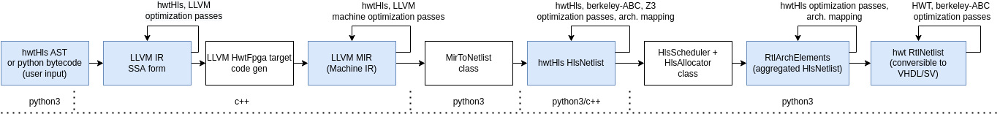

Problems of representation in HLS tools
=======================================

Translation of an algorithm to a hardware architecture is nearly never done directly.
Instead many intermediate formats and forms are used to represent the circuit in a different stage of translation.

Formats used in this library are following:

* :mod:`hwtHls.frontend.pyBytecode`: Python bytecode + CFG analysis
* :mod:`hwtHls.frontend.ast`: An AST object wich can be used to build code manually
* :mod:`hwtHls.ssa`: A simplified version of LLVM SSA internal representation (IR) for frontend
* llvm::IR: A main LLVM SSA IR
* llvm::MIR: A Machine level LLVM IR, non-SSA, an assembly like format for low level optimizations like register sharing
* :mod:`hwtHls.netlist`: A netlist for scheduiling and fine graded architecture features extraction
* :mod:`hwtHls.architecutre`: A hierarchical aggregated netlist for architecutre feature optimization and synchronization type tuning
* :mod:`hwt.synthesizer`: A hierarchical RTL like netlist used for lowering to target language, code generation
* :mod:`hwt.hdl`: An AST for code style optimization